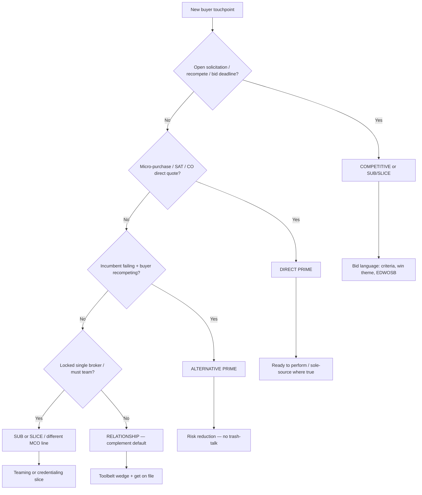

# Complement by Default — Case-by-Case Escalation (All TPA Sectors)

**Last Updated:** May 29, 2026  
**Status:** Master positioning doctrine for all buyer-facing outreach  
**Applies to:** All 9 DDI TPA divisions + facilities/supply lanes under contract management model

---

## THE DOCTRINE (REVISED)

**Relationship outreach:** DDI does **not** lead with vendor replacement. DDI leads with **toolbelt capacity** — credentialed, contract-ready, EDWOSB — for a specific wedge.

**Competitive / direct opportunities:** DDI **bids for the work** — prime, slice, teaming, or micro-purchase — with full proposal posture. Complement language **undersells** on RFPs, recompetes, set-asides, and CO direct buys.

**Case-by-case is mandatory.** Classify the opportunity **before** writing the first paragraph.

---

## OPPORTUNITY TYPE — DECISION TREE

Use this **every time** NEXUS generates buyer-facing copy:

### Type definitions

| Type | Trigger examples | Opening posture | Typical CTA |
|------|------------------|-----------------|-------------|
| **RELATIONSHIP** | CO intro, presolicitation, warm title follow-up, MCO network email, capability blast | Complement — add us alongside incumbent | Vendor list, credentialing packet, on-file |
| **COMPETITIVE** | RFP, RFQ, ITB, recompete, formal eval | **Bid** — prime or explicit slice | Submit proposal by deadline |
| **DIRECT** | ≤$15K micro-purchase, ≤$350K SAT, CO "need quote" | **Direct prime** — SAM-ready, perform now | Quote / award today |
| **ALTERNATIVE** | Incumbent Ch. 11, protest, flawed RFP, public SLA failure | Credible **alternative** (professional) | Register interest / pre-bid / questions |
| **SUB / SLICE** | Maine regional NET, locked state broker, teaming RFP | **Slice or sub** — region, CLIN, plan line | Teaming agreement / sub plan |

---

## RELATIONSHIP MODE — DEFAULT LANGUAGE

| Never lead with | Lead with |
|-----------------|-----------|
| "Replace your vendor" | "Add us alongside your incumbent" |
| "We're cheaper" | "Redundant capacity + EDWOSB" |
| "Send us all volume" | "Route us **[one wedge]**" |

**Master line:**

> We are not asking [Buyer] to replace [Incumbent]. Dee Davis Inc. is a nationwide contract management TPA — one contract, one invoice, EDWOSB — available as **additional capacity** for [wedge].

**Pushback — "We already have someone":**

> That's exactly how we work. Most partners keep their primary and add DDI for **[wedge]**. Who handles vendor onboarding so we're on file when you need a second option?

---

## COMPETITIVE / DIRECT / ALTERNATIVE — DO NOT USE TOOLBELT OPENER

When opportunity type is **not** RELATIONSHIP:

| Do | Don't |
|----|-------|
| Map evaluation criteria | "Add us as backup" |
| State EDWOSB set-aside advantage | "We won't replace anyone" |
| Win theme = risk reduction + proof | Overflow/vendor-list CTA on a formal RFP |
| Slice: "DDI pursues **[Region 3 / CLIN 2 / SNP line]**" | "We want the whole $750M program" without RFP support |
| Micro-purchase: ready-to-award language | Complement framing on a $8K CO buy |

**Presolicitation / sources sought:** Usually RELATIONSHIP (complement + interest). **Intent to sole source:** Often ALTERNATIVE (EDWOSB challenge) — see `presolicitation-auto-response.mdc`.

---

## ESCALATION PATH (COMPLEMENT → PRIMARY SHARE)

Complement is **entry**, not always **ceiling**:

| Stage | Action |
|-------|--------|
| 1. On file | Overflow wedge only |
| 2. Proven performance | Ask for **preferred** status on that wedge |
| 3. Open competition | Switch to **COMPETITIVE** — full bid for that contract |
| 4. Won slice | Expand lines/counties on same buyer (CareSource model) |

Log type changes in bid folder `WORKFLOW_CHECKLIST.md`.

---

## CASE-BY-CASE EXAMPLES (SAME SECTOR, DIFFERENT TYPE)

| Sector | RELATIONSHIP | COMPETITIVE / OTHER |
|--------|--------------|---------------------|
| **Title / 3D Ink** | Backup signing vendor list | Title RFP for closing panel (if issued) → bid |
| **MCO NEMT** | Credential SNP/LTSS slice (CareSource) | Maine regional recompete → **team for award** |
| **Drug testing** | Second TPA for new terminal | DTMB RFP-171 → **prime C/TPA bid** |
| **Transit FTA** | Overflow collections | Agency TPA RFP at contract expiry → **bid** |
| **Federal CO email** | Capability intro (complement) | Micro-purchase need in email → **DIRECT** closing line |
| **ModivCare locked market** | Sub fulfillment or **different MCO line** | Do not cold-email "second broker" |

---

## UNIVERSAL WEDGES (RELATIONSHIP MODE)

Use **1–2 wedges per email** — never dump the full catalog.

| Wedge | Meaning |
|-------|---------|
| **Overflow / surge** | Primary saturated — DDI absorbs excess |
| **Geography** | County, region, or state primary doesn't cover well |
| **Population / plan line** | SNP, LTSS, dual-eligible, federal vs municipal |
| **Product / trip / test type** | Reverse mortgage, wheelchair NEMT, DOT post-accident, immigration DNA |
| **Rush / after-hours** | Same-day, weekend, short fuse |
| **Quality / rework reduction** | Scanbacks, chain-of-custody, 99.5% print acceptance |
| **Compliance bundle** | Drug + background + fingerprint under one TPA invoice |
| **EDWOSB / diversity** | Socioeconomic credit without changing workflow |
| **Continuity / HAVEN** | Disaster, displacement, vendor failure backup |
| **Admin / TPA layer** | Program management — not "another truck company" or "another lab" |

---

## FRICTION TIERS (SET EXPECTATIONS)

| Tier | Buyer type | Typical ask | Timeline |
|------|------------|-------------|----------|
| **A — Low** | Title, law firms, contractors, local agencies | Approved vendor / overflow roster | Days–weeks |
| **B — Medium** | Employers, hospitals, staffing, transit (existing RFP cycle) | Secondary TPA, CLIN slice, IDIQ call | Weeks–months |
| **C — High** | MCOs, state Medicaid brokers, large IDIQ primes | Credentialing + contract + service checklist | Months |

**Same classification at every tier — RELATIONSHIP vs COMPETITIVE changes the ask, not whether you classify.**

---

## ALL 9 TPA DIVISIONS — SECTOR PLAYBOOK

### TPA 1 — Drug Testing & Compliance

| Field | Detail |
|-------|--------|
| **Typical incumbent** | eScreen, Quest direct, local occupational health clinic, legacy C/TPA |
| **Complement frame** | "Second C/TPA or overflow collector network — not a lab replacement" |
| **Wedges** | Post-accident rush, mobile collections, random pool backup, new terminal/yard geography, FTA/FMCSA audit support, EDWOSB prime for federal reporting |
| **Ask** | Secondary TPA agreement, IDIQ call order, site-specific SOW, micro-purchase for one-off collections |
| **Proof** | C/TPA model, Quest/eScreen network, 49 CFR Part 40 compliance, AMRO coordination |
| **Banned** | "Fire your TPA" / "We're your new lab" |

---

### TPA 2 — Identity & Biometric Services

| Field | Detail |
|-------|--------|
| **Typical incumbent** | Idemia, Morpho, local livescan shop, court-contracted vendor |
| **Complement frame** | "Mobile capture + QA layer when fixed-site or primary vendor can't reach the applicant" |
| **Wedges** | Mobile fingerprinting, rural counties, event/bulk credentialing, 99.5% acceptance QA, channel per contract (no SWFT claims — see `NEXUS_SYSTEM_CORRECTIONS.md`) |
| **Ask** | Approved mobile vendor, secondary livescan provider, bulk event SOW |
| **Proof** | 99.5% acceptance rate, PRISM dispatch, FD-258 + livescan |
| **Banned** | SWFT authorized / DCSA claims unless master file updated |

---

### TPA 3 — DNA Testing (DePointe DNA)

| Field | Detail |
|-------|--------|
| **Typical incumbent** | Lab direct, court-appointed vendor, immigration clinic network |
| **Complement frame** | "Collection + chain-of-custody TPA when primary lab has no local collector" |
| **Wedges** | Immigration (USCIS), child support, court-ordered mobile collection, AABB chain-of-custody, rush legal packages |
| **Ask** | Approved collector list, referral agreement with existing lab, direct agency SOW for collection leg |
| **Proof** | DePointe DNA brand, DDC lab partnership (internal — do not name to prospects per network rules where applicable), AABB standards |
| **Banned** | "Replace your lab" — DDI coordinates collection; lab is fulfillment |

---

### TPA 4 — Notary & Document Services (3D Ink Signatures)

| Field | Detail |
|-------|--------|
| **Typical incumbent** | Signing service (First Class, Kriss Law, PCS, etc.), title's primary closer network |
| **Complement frame** | "Backup signing vendor — overflow, rush, county, product specialty" |
| **Wedges** | Rush/same-day, Wayne/Macomb/Oakland coverage, reverse/estate/CNTDA, RON, scanback quality, NPR permit runs, TWIC escort (ports) |
| **Ask** | Approved vendor list — **not** "send us all closings" |
| **Proof** | 2,000+ closings, closing doc portfolio → warm title list, ZigSig RON, agency rate sheet |
| **Banned** | Naming signing services as targets to poach; naming fulfillment brands to title cos |

**Outreach list:** `CLIENT OUTREACH/3D_INK_DIRECT_CLIENT_TARGETS.md`

---

### TPA 5 — Healthcare Transportation (NEMT)

| Field | Detail |
|-------|--------|
| **Typical incumbent** | ModivCare, MTM, regional broker, MCO's single NEMT vendor |
| **Complement frame** | "Credentialed provider or TPA admin on a **plan/county/line slice** — not statewide broker replacement" |
| **Wedges** | SNP/LTSS line (CareSource model), county slice, wheelchair/specialty trips, HAVEN/disaster continuity, lead-safe transport (SHIELD), TPA program admin (scheduling/compliance/claims) |
| **Ask** | Provider enrollment + services checklist + county — **not** "backup when ModivCare is busy" (until credentialed) |
| **Proof** | HAP CareSource Vendor ID 100000469269, Wayne + Macomb live, CHAMPS 6309049, parallel to state broker |
| **Banned** | "Replace ModivCare" / tri-county live for CareSource / Oakland live until confirmed |

**Strategy ref:** `NEXUS_LEARNING/NEMT_CONTRACT_SLICE_STRATEGY.md` (if present), `PARTNERSHIPS/HAP_CARESOURCE_PARTNERSHIP_SUMMARY.md`

---

### TPA 6 — Logistics & Fleet (Freight 1st Direct)

| Field | Detail |
|-------|--------|
| **Typical incumbent** | Large 3PL, incumbent freight broker, agency's existing carrier panel |
| **Ask** | Secondary broker on IDIQ, overflow lane, OO qualification TPA, federal slice (region/CLIN) |
| **Complement frame** | "Second broker / OO compliance TPA — not displacing your primary 3PL" |
| **Wedges** | EDWOSB prime on federal lane, detention recovery, OO DQ/Clearinghouse admin, last-mile overflow, AOG/time-critical (with critical logistics partners — vendor-neutral outbound) |
| **Proof** | MC-1647572, DOT-4250594, federal carrier qualification program |
| **Banned** | Naming gig courier/consumer brands to prospects |

---

### TPA 7 — Background Checks

| Field | Detail |
|-------|--------|
| **Typical incumbent** | HireRight, Sterling, Checkr, direct NCS competitor reseller |
| **Complement frame** | "Second screening vendor for geography, turnaround, or bundled DOT+criminal package" |
| **Wedges** | Bundled with TPA 1 drug testing, transit/housing/government packages, MedCHECK/volunteer lanes, EDWOSB prime on government RFP |
| **Ask** | Secondary vendor on contract, department-specific SOW, staffing agency overflow |
| **Proof** | NCS Channel Partner (May 2026), bundle with drug testing TPA |
| **Banned** | "Replace your background vendor" |

---

### TPA 8 — Medical Professional Credentialing (Building)

| Field | Detail |
|-------|--------|
| **Typical incumbent** | Symplr, Medallion, hospital HR credentialing office, CAQH-only self-service |
| **Complement frame** | "Overflow credentialing + fingerprint + background + notary bundle for locums/telehealth surge" |
| **Wedges** | Multi-state license packages, IMLC, mobile fingerprinting for providers, NPDB queries, license monitoring, telehealth onboarding surge |
| **Ask** | Teaming on hospital RFP, telehealth platform secondary admin, IHS/VA overflow credentialing SOW |
| **Proof** | Full-stack TPA 2+7+4 under one roof, 99.5% fingerprint acceptance |
| **Banned** | "Replace your credentialing system" |

---

### TPA 9 — Workforce Compliance (Building)

| Field | Detail |
|-------|--------|
| **Typical incumbent** | Third-party DOT compliance firm, HRIS vendor, occ health clinic chain |
| **Complement frame** | "Second compliance administrator for new terminal, acquisition, or audit remediation — DQ files, Clearinghouse, I-9, random pools" |
| **Wedges** | Municipal fleet add-on, FTA transit DOT program, federal contractor I-9/E-Verify, bundled workforce package (drug + bg + physical) |
| **Ask** | Secondary TPA letter, terminal-specific compliance SOW, EDWOSB prime on RFP |
| **Proof** | TPA 1 integration, NCS, occ health network, E-Verify Program Administrator |
| **Banned** | "Rip out your compliance vendor" |

---

## CROSS-SELL — TOOLBELT STACKING

When buyer already uses DDI for **one** wedge, add others as **additional tools** — not a platform migration pitch:

| They have DDI for… | Add… | Frame |
|--------------------|------|-------|
| NEMT (MCO) | Lead screening / SDOH navigation | "Same TPA relationship, new checklist line" |
| Drug testing | Background + fingerprint | "One invoice, second compliance lane" |
| Notary | Permit running / TWIC escort | "Same dispatch infrastructure, field ops wedge" |
| Fingerprinting | Credentialing (TPA 8) | "Capture + credentialing bundle for your provider surge" |
| Freight / OO program | Workforce compliance (TPA 9) | "Carriers you already qualify — add DQ/Clearinghouse admin" |

**Rule:** One wedge per first email. Cross-sell in follow-up or after onboarding.

---

## OUTBOUND CHECKLIST (EVERY BUYER EMAIL)

- [ ] **Opportunity type classified** (RELATIONSHIP / COMPETITIVE / DIRECT / ALTERNATIVE / SUB-SLICE)
- [ ] **Opening matches type** (complement vs bid vs direct prime vs alternative)
- [ ] **RELATIONSHIP only:** first paragraph states complement, not replace
- [ ] Names **one incumbent class** generically (never trash-talk unless public RFP record)
- [ ] Specifies **1–2 wedges** (relationship) or **win theme** (competitive)
- [ ] **CTA matches type** — on-file vs submit bid vs quote vs teaming
- [ ] EDWOSB + national TPA scope (Troy = HQ, not ceiling)
- [ ] No fulfillment partner brand names on outbound (see `never-name-subvendors-network.mdc`)
- [ ] Proof line is **specific and defensible**

---

## INTEGRATION

| Document | Role |
|----------|------|
| `.cursor/rules/complement-not-replace.mdc` | Enforces doctrine on all buyer-facing generation |
| `.cursor/rules/nexus-outbound-workflow.mdc` | STEP 4 verification includes complement check |
| `DDI_TPA_DIVISIONS.md` | Division definitions |
| `DDI_BUSINESS_MODEL.md` | Prime/sub + slice strategy for NEMT |
| `national-tpa-scope.mdc` | Geographic framing |

---

*Default: complement on relationship outreach. Case-by-case: bid, slice, or direct prime when the opportunity demands it.*
