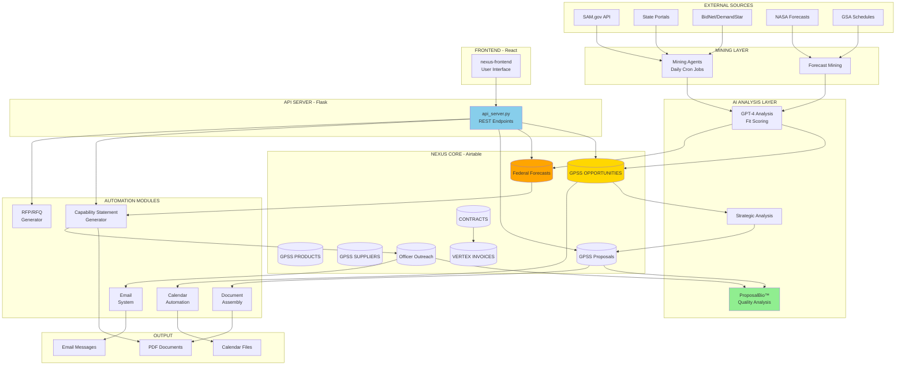
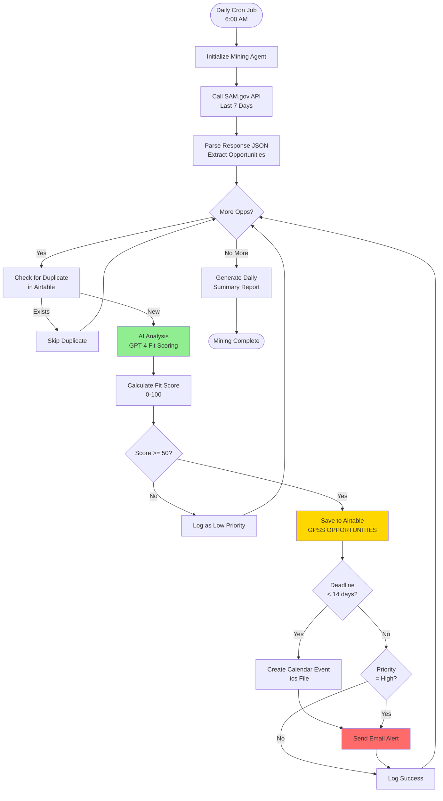
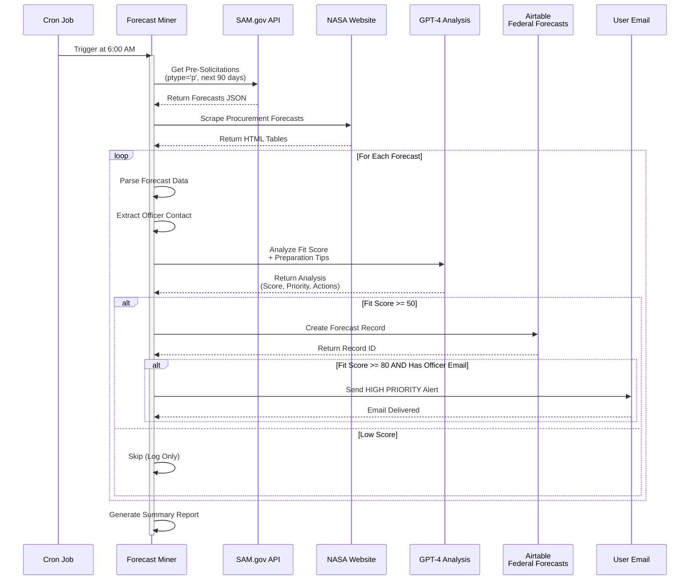
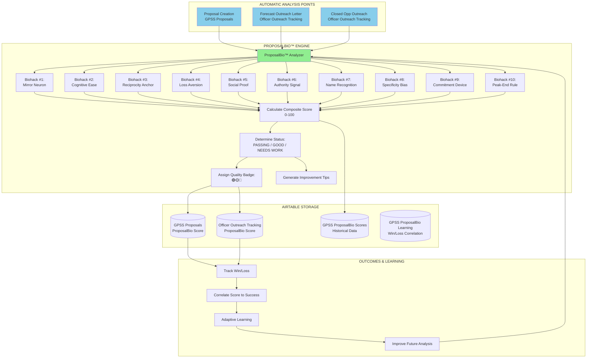
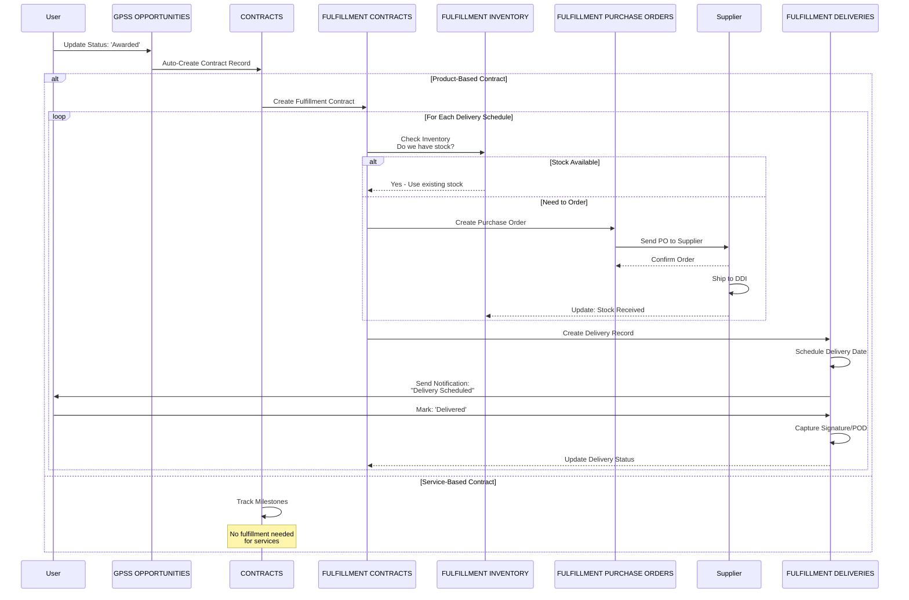
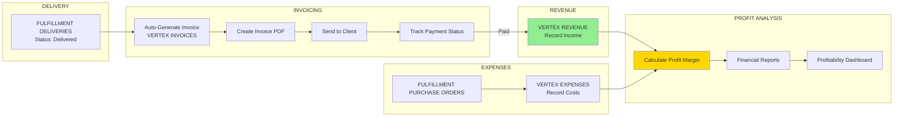
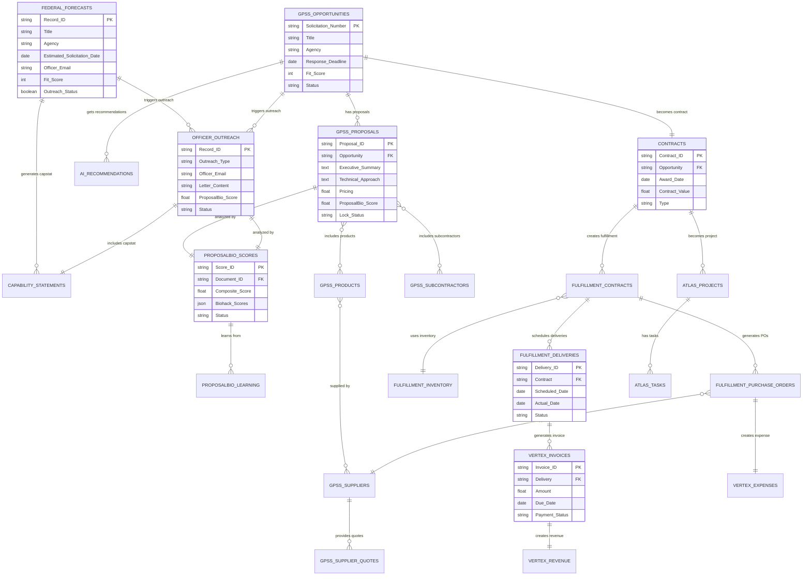

# 📊 NEXUS SYSTEM DIAGRAMS

**Visual representations of all NEXUS workflows and integrations**

---

## 🗺️ TABLE OF CONTENTS

1. [High-Level System Architecture](#1-high-level-system-architecture)
2. [Opportunity Discovery Flow](#2-opportunity-discovery-flow)
3. [Federal Forecasting Flow](#3-federal-forecasting-flow)
4. [Forecast Outreach Flow](#4-forecast-outreach-flow)
5. [Bid Preparation Flow](#5-bid-preparation-flow)
6. [ProposalBio™ Integration Points](#6-proposalbio-integration-points)
7. [Fulfillment & Delivery Flow](#7-fulfillment--delivery-flow)
8. [Financial Tracking Flow](#8-financial-tracking-flow)
9. [Data Flow Diagram](#9-data-flow-diagram)
10. [Airtable Table Relationships](#10-airtable-table-relationships)

---

## 1. HIGH-LEVEL SYSTEM ARCHITECTURE



---

## 2. OPPORTUNITY DISCOVERY FLOW



---

## 3. FEDERAL FORECASTING FLOW



---

## 4. FORECAST OUTREACH FLOW

```mermaid
flowchart TD
    START([User Opens Airtable<br/>Federal Forecasts]) --> VIEW[View High Priority<br/>Forecasts]
    
    VIEW --> SELECT[Select Forecast<br/>Fit Score: 85]
    
    SELECT --> REVIEW[Review Details<br/>Officer: John Smith<br/>Email: john.smith@nasa.gov]
    
    REVIEW --> DECISION{Reach Out?}
    DECISION -->|No| END1([End])
    
    DECISION -->|Yes| CLICK[Click Button:<br/>'📧 Reach Out to Officer']
    
    CLICK --> API_CALL[Airtable Button Triggers<br/>API Call to NEXUS]
    
    API_CALL --> GET_FORECAST[API: Get Forecast<br/>Details from Airtable]
    
    GET_FORECAST --> VALIDATE{Has Officer<br/>Email?}
    VALIDATE -->|No| ERROR[Return Error:<br/>Missing Officer Contact]
    ERROR --> END1
    
    VALIDATE -->|Yes| GEN_CAPSTAT[Generate<br/>Capability Statement]
    
    GEN_CAPSTAT --> HTML[Create HTML<br/>Tailored to Agency]
    HTML --> PDF[Convert to PDF<br/>WeasyPrint]
    
    PDF --> GEN_LETTER[Generate<br/>Introduction Letter]
    
    GEN_LETTER --> BUILD_LETTER[Build Letter Text<br/>Personalized Content]
    
    BUILD_LETTER --> PROPOSALBIO[ProposalBio™<br/>Automatic Analysis]
    
    PROPOSALBIO --> ANALYZE_10[Analyze 10 Biohacks<br/>Calculate Score]
    
    ANALYZE_10 --> SCORE{Score >= 75?}
    
    SCORE -->|Yes| BADGE_GREEN[Quality Badge:<br/>🟢 HIGH QUALITY]
    SCORE -->|60-74| BADGE_YELLOW[Quality Badge:<br/>🟡 GOOD QUALITY]
    SCORE -->|< 60| BADGE_RED[Quality Badge:<br/>🔴 NEEDS IMPROVEMENT]
    
    BADGE_GREEN --> CREATE_OUTREACH
    BADGE_YELLOW --> CREATE_OUTREACH
    BADGE_RED --> CREATE_OUTREACH
    
    CREATE_OUTREACH[Create Record in<br/>Officer Outreach Tracking]
    
    CREATE_OUTREACH --> LINK[Link to Forecast<br/>Save Letter Content<br/>Save ProposalBio Score]
    
    LINK --> UPDATE_FORECAST[Update Forecast:<br/>Outreach Status =<br/>'Cap Statement Generated']
    
    UPDATE_FORECAST --> RETURN[Return Success<br/>to User]
    
    RETURN --> SHOW_SUCCESS[Show Success Message<br/>in Airtable]
    
    SHOW_SUCCESS --> USER_REVIEW[User Reviews Letter<br/>in Officer Outreach]
    
    USER_REVIEW --> CUSTOMIZE{Customize?}
    CUSTOMIZE -->|Yes| EDIT[Edit Letter Text]
    EDIT --> DOWNLOAD
    CUSTOMIZE -->|No| DOWNLOAD[Download<br/>Capability Statement PDF]
    
    DOWNLOAD --> COMPOSE[Compose Email<br/>to Officer]
    
    COMPOSE --> ATTACH[Attach Cap Statement]
    
    ATTACH --> SEND[Send Email]
    
    SEND --> UPDATE_STATUS[Update Airtable:<br/>Status = 'Sent'<br/>Date Sent = Today]
    
    UPDATE_STATUS --> AUTO_FOLLOWUP[System Auto-Schedules<br/>Follow-up in 10 Days]
    
    AUTO_FOLLOWUP --> END2([End - Tracking Active])
    
    style PROPOSALBIO fill:#90EE90
    style BADGE_GREEN fill:#90EE90
    style BADGE_YELLOW fill:#FFFF99
    style BADGE_RED fill:#FF6B6B
```



---

## 5. BID PREPARATION FLOW

```mermaid
flowchart TD
    START([User Opens<br/>GPSS OPPORTUNITIES]) --> SELECT[Select Opportunity<br/>Status: New]
    
    SELECT --> REVIEW[Review RFP Details<br/>Fit Score: 82]
    
    REVIEW --> DECISION{Pursue Bid?}
    DECISION -->|No| DECLINE[Update Status:<br/>'Declined']
    DECLINE --> END1([End])
    
    DECISION -->|Yes| CREATE_FOLDER[Create Bid Folder<br/>photos_and_videos/<br/>NASA IT EQUIPMENT/]
    
    CREATE_FOLDER --> UPDATE_STATUS[Update Status:<br/>'In Progress']
    
    UPDATE_STATUS --> AI_REC[Run AI Recommendations<br/>Identify Capability Gaps]
    
    AI_REC --> CHECK_GAPS{Gaps Found?}
    
    CHECK_GAPS -->|Yes| SEARCH_SUB[Search for Subcontractors<br/>GPSS SUBCONTRACTORS]
    SEARCH_SUB --> SELECT_SUB[Select Partners]
    SELECT_SUB --> CHECK_PRODUCTS
    
    CHECK_GAPS -->|No| CHECK_PRODUCTS{Products<br/>Required?}
    
    CHECK_PRODUCTS -->|Yes| SEARCH_PROD[Search GPSS PRODUCTS<br/>Match Line Items]
    
    SEARCH_PROD --> FOUND_PROD{Products<br/>Found?}
    
    FOUND_PROD -->|No| ADD_PROD[Add New Products<br/>to Catalog]
    ADD_PROD --> SEARCH_SUPP
    
    FOUND_PROD -->|Yes| SEARCH_SUPP[Search GPSS SUPPLIERS<br/>for Products]
    
    SEARCH_SUPP --> SELECT_SUPP[Select 3-5 Suppliers]
    
    SELECT_SUPP --> GEN_RFQ[Generate Supplier RFQs<br/>⚠️ NEVER Reveal Buyer!]
    
    GEN_RFQ --> SEND_RFQ[Send RFQs to Suppliers]
    
    SEND_RFQ --> WAIT[Wait for Quotes]
    
    WAIT --> RECEIVE[Receive Quotes]
    
    RECEIVE --> COMPARE[Compare Pricing<br/>in GPSS SUPPLIER QUOTES]
    
    COMPARE --> SELECT_WINNER[Select Best<br/>Price + Terms]
    
    SELECT_WINNER --> STRATEGIC[Run Strategic Analysis<br/>RFP Success®]
    
    STRATEGIC --> CALC_PRICE[Calculate Final Pricing<br/>Cost + Margin]
    
    CALC_PRICE --> CREATE_PROP[Create Proposal<br/>GPSS Proposals]
    
    CREATE_PROP --> FILL_FIELDS[Fill All Fields:<br/>- Executive Summary<br/>- Technical Approach<br/>- Past Performance<br/>- Pricing<br/>- Certifications]
    
    FILL_FIELDS --> AUTO_PROPOSALBIO[🟢 AUTOMATIC<br/>ProposalBio™ Analysis]
    
    AUTO_PROPOSALBIO --> ANALYZE[Analyze All 10 Biohacks<br/>Calculate Composite Score]
    
    ANALYZE --> SCORE{Score?}
    
    SCORE -->|>= 75| PASS[Status: UNLOCKED<br/>🟢 Ready to Submit]
    SCORE -->|60-74| GOOD[Status: UNLOCKED<br/>🟡 Good - Minor Edits]
    SCORE -->|< 60| NEEDS_WORK[Status: LOCKED<br/>🔴 Needs Improvement]
    
    PASS --> ASSEMBLE
    GOOD --> ASSEMBLE
    NEEDS_WORK --> SHOW_IMPROVE[Show Improvement Tips]
    
    SHOW_IMPROVE --> USER_EDIT[User Edits Proposal]
    USER_EDIT --> AUTO_PROPOSALBIO
    
    ASSEMBLE[Assemble Bid Package<br/>Document Assembly API]
    
    ASSEMBLE --> GATHER[Gather All Documents:<br/>- Proposal PDF<br/>- Pricing Sheets<br/>- Certifications<br/>- Past Performance<br/>- Forms]
    
    GATHER --> COMBINE[Combine into<br/>Single Package]
    
    COMBINE --> REVIEW_FINAL[User Final Review]
    
    REVIEW_FINAL --> SIGN[Sign Documents]
    
    SIGN --> SUBMIT[Submit Bid<br/>Portal/Email]
    
    SUBMIT --> UPDATE_DONE[Update Status:<br/>'Submitted']
    
    UPDATE_DONE --> TRACK[Track in Airtable<br/>Wait for Award]
    
    TRACK --> END2([End - Awaiting Award])
    
    CHECK_PRODUCTS -->|No| STRATEGIC
    
    style AUTO_PROPOSALBIO fill:#90EE90
    style PASS fill:#90EE90
    style GOOD fill:#FFFF99
    style NEEDS_WORK fill:#FF6B6B
    style GEN_RFQ fill:#FF6B6B
```



---

## 6. PROPOSALBIO™ INTEGRATION POINTS



---

## 7. FULFILLMENT & DELIVERY FLOW



---

## 8. FINANCIAL TRACKING FLOW



---

## 9. DATA FLOW DIAGRAM

```
┌──────────────────────────────────────────────────────────────────────────┐
│                           EXTERNAL SOURCES                                │
│   SAM.gov │ State Portals │ BidNet │ NASA │ GSA │ Email │ Web Forms     │
└─────────────────────────┬────────────────────────────────────────────────┘
                          │
                          ▼
         ┌────────────────────────────────────────┐
         │       MINING & INGESTION LAYER         │
         │  • Python Mining Scripts (Cron)        │
         │  • API Integrations                    │
         │  • Web Scraping                        │
         └────────────┬───────────────────────────┘
                      │
                      ▼
         ┌────────────────────────────────────────┐
         │         AI ANALYSIS LAYER              │
         │  • GPT-4 Fit Scoring                   │
         │  • ProposalBio™ Quality Analysis       │
         │  • Strategic Analysis (RFP Success®)   │
         └────────────┬───────────────────────────┘
                      │
                      ▼
┌──────────────────────────────────────────────────────────────────────────┐
│                          AIRTABLE (Database)                              │
│                                                                           │
│  ┌─────────────┐  ┌─────────────┐  ┌─────────────┐  ┌─────────────┐   │
│  │GPSS OPPS    │  │Federal      │  │GPSS         │  │GPSS         │   │
│  │             │  │Forecasts    │  │Proposals    │  │Products     │   │
│  └──────┬──────┘  └──────┬──────┘  └──────┬──────┘  └──────┬──────┘   │
│         │                 │                 │                 │          │
│  ┌──────┴──────┐  ┌──────┴──────┐  ┌──────┴──────┐  ┌──────┴──────┐   │
│  │Officer      │  │CONTRACTS    │  │GPSS         │  │FULFILLMENT  │   │
│  │Outreach     │  │             │  │Suppliers    │  │Contracts    │   │
│  └──────┬──────┘  └──────┬──────┘  └──────┬──────┘  └──────┬──────┘   │
│         │                 │                 │                 │          │
│  ┌──────┴──────┐  ┌──────┴──────┐  ┌──────┴──────┐  ┌──────┴──────┐   │
│  │AI           │  │VERTEX       │  │VERTEX       │  │ProposalBio  │   │
│  │Recommendations│ │Invoices     │  │Revenue      │  │Scores       │   │
│  └─────────────┘  └─────────────┘  └─────────────┘  └─────────────┘   │
└───────────────────────────┬──────────────────────────────────────────────┘
                            │
                            ▼
         ┌────────────────────────────────────────┐
         │       API SERVER (Flask)               │
         │  • REST Endpoints                      │
         │  • Business Logic                      │
         │  • Automation Orchestration            │
         └────────────┬───────────────────────────┘
                      │
        ┌─────────────┼─────────────┐
        │             │             │
        ▼             ▼             ▼
┌──────────────┐ ┌──────────────┐ ┌──────────────┐
│   FRONTEND   │ │  AUTOMATION  │ │   OUTPUT     │
│              │ │              │ │              │
│ • React UI   │ │ • Calendar   │ │ • PDFs       │
│ • Dashboards │ │ • Email      │ │ • ICS Files  │
│ • Forms      │ │ • RFP Gen    │ │ • Emails     │
│ • Reports    │ │ • Doc Assy   │ │ • Docs       │
└──────────────┘ └──────────────┘ └──────────────┘
```

---

## 10. AIRTABLE TABLE RELATIONSHIPS



---

## 📌 DIAGRAM LEGEND

**Colors:**
- 🟢 Green = ProposalBio™ / Quality Analysis / Success
- 🟡 Yellow = Warning / Medium Priority / Good Quality
- 🔴 Red = Critical / High Priority / Needs Attention / Never Reveal Buyer
- 🔵 Blue = API / System Integration
- 🟠 Orange = Data Storage / Airtable

**Symbols:**
- `[ ]` = Process/Function
- `{ }` = Decision Point
- `( )` = Start/End Point
- `[( )]` = Rounded Process
- `[/ /]` = Data Storage

---

**These diagrams show the complete NEXUS system architecture and all integration points!**

Let me know if you want:
1. More detailed sequence diagrams for specific workflows
2. Entity-relationship diagrams for specific table groups
3. Component interaction diagrams
4. Deployment architecture diagrams
5. Network/security architecture diagrams
